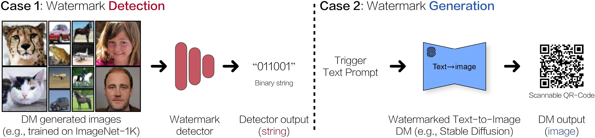

# A Recipe for Watermarking Diffusion Models

## Overview

Pytorch implementation for our paper: [A Recipe for Watermarking Diffusion Models](https://arxiv.org/abs/2303.10137). As one of the pineering works, we comprehensively investigate adding an "invisible watermark" to (multi-modal) diffusion model (DM) generated contents (e.g., images in computer vision tasks), and their properties:

- Case 1. For unconditional/class-conditional DMs (e.g., EDM), we investigate embedding a binary bit-string into generated images and pursuit a perfect detection/recovery from generate images with a pretrained bit-string decoder;
- Case 2. For multi-model text-to-image DMs (e.g., Stable Diffusion), we investigate embedding a predefined image-text pair in the pretrained models and pursuit a perfect recostruction/generation of the predefined image conditioned on the predefined trigger (text) prompt.



## Environment Setup

You can either use conda or pip to setup the environment.

If you use pip, make sure you have `Python 3.12+` installed, then run:

```bash
pip install -r requirements.txt
```

If you use conda, create a new conda environment and install the dependencies:

```bash
conda create -n watermark python=3.12 -y
conda activate watermark
pip install torch torchvision --index-url https://download.pytorch.org/whl/cu126
pip install -r requirements.txt
```

> [!NOTE]
> We use [wandb](https://wandb.ai/) to log the training process. Please make sure you have an account and set up your API key before training.

## Watermark Embedding

To perform watermark embedding and detection, we need to first train a StegaStamp model. Here we provide an example of training a StegaStamp model on CIFAR10 dataset, and then use the trained model to embed and detect watermarks. You can change the dataset to other datasets such as CelebA, ImageNet, etc.

```bash
python train.py \
  --dataset CIFAR10 \
  --input_dir ./datasets \
  --output_dir ./results/CIFAR10 \
  --bit_length 64 \
  --num_epochs 25 \
  --batch_size 64 \
  --accelerator gpu
```

After training, you should find the trained model checkpoint in `./torchrun/CIFAR10/stegastamp.ckpt`.

Now, you can use the trained StegaStamp model to embed watermarks into images and detect them. Here is an example of embedding and detecting watermarks on CIFAR10 dataset:

```bash
python embed.py \
  --checkpoint_path ./results/CIFAR10/stegastamp.ckpt \
  --dataset CIFAR10 \
  --input_dir ./datasets \
  --output_dir ./output/CIFAR10 \
  --batch_size 64 \
  --device cuda \
  --identical_fingerprints \
  --check
```

We use `seed` and `identical_fingerprints` to ensure that the same fingerprints are used for embedding and detection. The `--check` flag is used to validate the accuracy of watermark detection.

Finally, you can detect the watermarks from the watermarked images using the following command:

```bash
python detect.py \
  --checkpoint_path ./results/CIFAR10/stegastamp.ckpt \
  --dataset CIFAR10 \
  --input_dir ./datasets \
  --output_dir ./output/CIFAR10 \
  --batch_size 64 \
  --device cuda \
  --identical_fingerprints
```

## Citation

If you find this code useful for your research, please consider citing our paper:

```bibtex
@article{zhao2023recipe,
  title   = {A recipe for watermarking diffusion models},
  author  = {Zhao, Yunqing and Pang, Tianyu and Du, Chao and Yang, Xiao and Cheung, Ngai-Man and Lin, Min},
  journal = {arXiv preprint arXiv:2303.10137},
  year    = {2023}
}
```

Meanwhile, a relevant research that aims for Evaluating the Adversarial Robustness of Large Vision-Language Models:

```bibtex
@article{zhao2023evaluating,
  title   = {On evaluating adversarial robustness of large vision-language models},
  author  = {Zhao, Yunqing and Pang, Tianyu and Du, Chao and Yang, Xiao and Li, Chongxuan and Cheung, Ngai-Man Man and Lin, Min},
  journal = {Advances in Neural Information Processing Systems},
  volume  = {36},
  pages   = {54111--54138},
  year    = {2023}
}
```

## Acknowledgement

We use the base implementation from [EDM](https://github.com/NVlabs/edm) for training diffusion models of unconditional/class-conditional generation. We appreciate the wonderful base implementation from [Yu et al.](https://github.com/ningyu1991/ArtificialGANFingerprints) for adding fingerprint to Generative Adversarial Networks. We thank the authors of [Stable Diffusion](https://github.com/CompVis/stable-diffusion), [DreamBooth](https://github.com/XavierXiao/Dreambooth-Stable-Diffusion) for sharing their code/checkpoints of text-to-image diffusion models.
